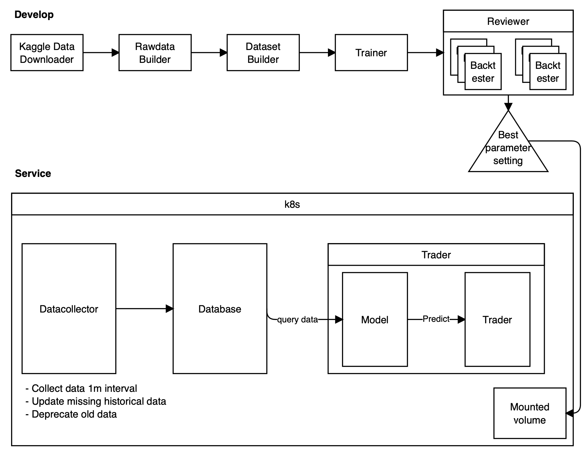
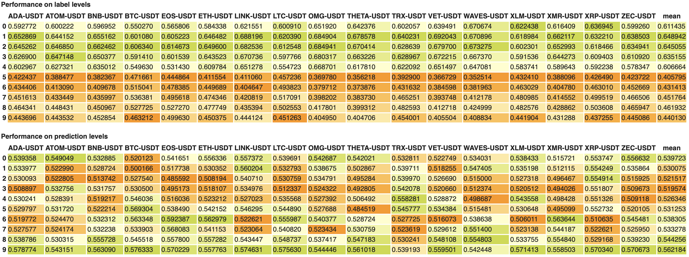
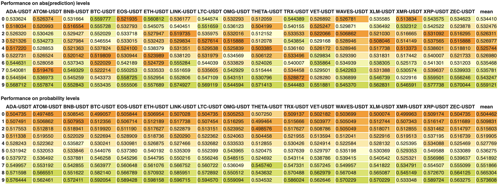
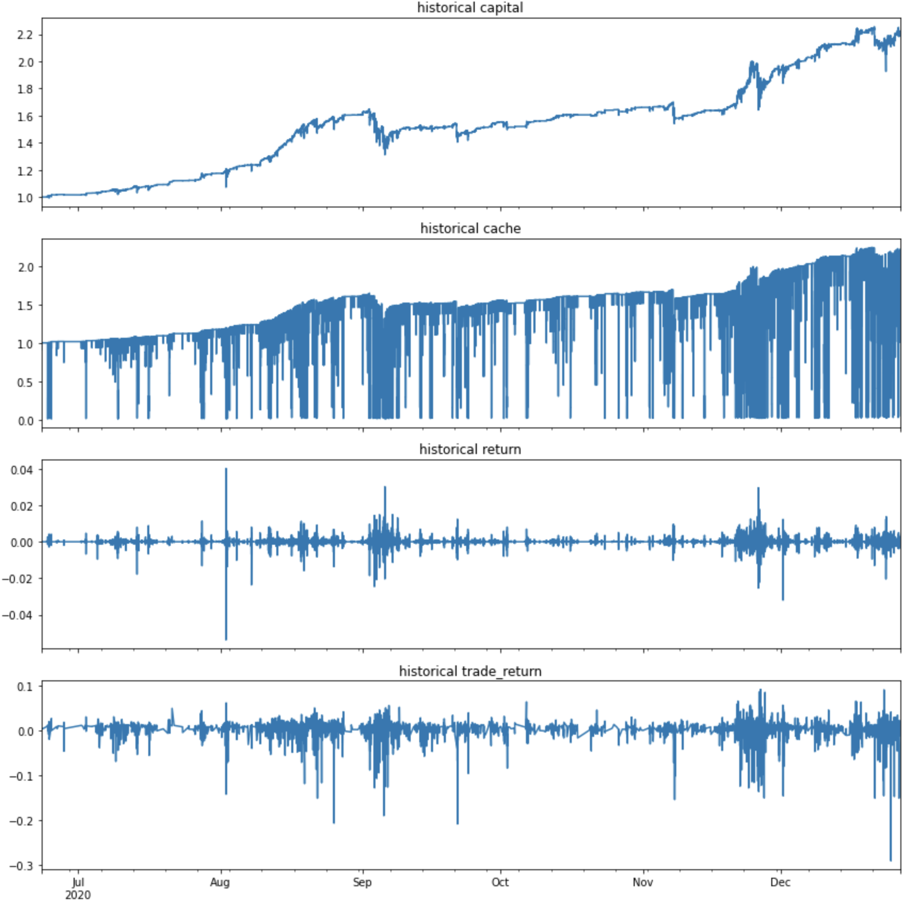

# Binance Future Trader
Binance future trader deals in multiple cryptocurrencies simultaneously. In default, the model predict 30min ahead, and trade every 1min.
* Note: If want to predict other time periods, you can change lookahead_window variable to what you want to predict.

## Schema

```
.
├── Makefile
├── README.md
├── develop
│   ├── Makefile
│   ├── dockerfiles
│   │   ├── Dockerfile
│   │   └── requirements.txt
│   ├── src
│   │   ├── backtester
│   │   │   ├── __init__.py
│   │   │   ├── backtester_v1.py
│   │   │   ├── basic_backtester.py
│   │   │   └── utils.py
│   │   ├── common_utils_dev
│   │   │   ├── __init__.py
│   │   │   └── common_utils_dev.py
│   │   ├── dataset_builder
│   │   │   └── build_dataset.py
│   │   ├── rawdata_builder
│   │   │   ├── __init__.py
│   │   │   ├── build_rawdata.py
│   │   │   ├── candidate_assets.txt
│   │   │   └── download_kaggle_data.py
│   │   ├── reviewer
│   │   │   ├── __init__.py
│   │   │   ├── paramset.py
│   │   │   ├── reviewer_v1.py
│   │   │   └── utils.py
│   │   └── trainer
│   │       ├── datasets
│   │       │   └── dataset.py
│   │       ├── models
│   │       │   ├── __init__.py
│   │       │   ├── backbones
│   │       │   │   ├── __init__.py
│   │       │   │   └── backbone_v1.py
│   │       │   ├── basic_predictor.py
│   │       │   ├── criterions.py
│   │       │   ├── predictor_v1.py
│   │       │   └── utils.py
│   │       └── modules
│   │           ├── acts.py
│   │           └── block_1d
│   │               ├── __init__.py
│   │               ├── conv1d.py
│   │               ├── dense.py
│   │               ├── dense_block.py
│   │               ├── norms.py
│   │               ├── residual.py
│   │               ├── seblock.py
│   │               └── self_attention.py
│   └── storage
│       ├── dataset
│       └── experiments
└── services
    ├── Makefile
    ├── dockerfiles
    │   ├── Dockerfile
    │   └── requirements.txt
    ├── k8s
    │   ├── admin
    │   │   └── namespace.yml
    │   ├── deployments
    │   │   ├── data_collector.yml
    │   │   ├── database.yml
    │   │   └── trader.yml
    │   ├── deployments-template
    │   │   ├── data_collector-template.yml
    │   │   ├── database-template.yml
    │   │   └── trader-template.yml
    │   └── service
    │       └── service.yml
    ├── src
    │   ├── common_utils_svc
    │   │   ├── __init__.py
    │   │   └── common_utils_svc.py
    │   ├── config
    │   │   └── __init__.py
    │   ├── data_collector
    │   │   └── data_collector.py
    │   ├── database
    │   │   ├── database.py
    │   │   ├── models.py
    │   │   └── usecase.py
    │   ├── exchange
    │   │   └── custom_client.py
    │   ├── handler
    │   │   ├── __init__.py
    │   │   └── slack_handler.py
    │   └── trader
    │       ├── trader_v1.py
    │       └── utils.py
    └── storage
        └── database
```
## Descriptions
### Model
 - Based on DenseNet.
 - Add Squeeze and Excitation block before transition block
 - Add Self-Attention block before transition block
 - Use Activation function as SELU. selectable [Mish, tanhexp]
 - Use Dropout block as Combine(AlphaDropout, SpatialDropout)
   - Dropout not only for time-series, but also for channels.
### Performance
#### Model performance




#### Backtest performance
The results below are after the commission was paid to the exchange.
Backtesting setting `Commisions: {"entry": 0.04%, "exit": 0.02% | 0.04%, "spread": 0.04%}`
```
trade_winning_ratio    0.690894
trade_sharpe_ratio     2.100903
trade_avg_return       0.002093
max_drawdown          -0.204948
total_return           1.217380
```



## Usages
Follow below steps.
 - You can give additional variable to execute command with tag `make <command> ARGS="--variable1 <value> --variable2 <value>"`
 - All code run on same container by reuse. Once if execute run container, it run continuously, and reused by other command.
### For develop
:sparkles:`make dev_run GPU_TYPE="<NVIDIA or AMD>"`: Run container to develop  
:sparkles:`make dev_download_kaggle_data ARGS="--username <kaggle_username> --key <kaggle_key>"`: Download historical pricing data
```
 - In here, I implemented kaggle data downloader, but never checked. I recommend to download files manually through website.  
 - Download from https://www.kaggle.com/jorijnsmit/binance-full-history, then store to <pwd>/develop/storage/dataset/rawdata/raw/spot/  
 - Download from https://www.kaggle.com/nicolaes/binance-futures, then store to <pwd>/develop/storage/dataset/rawdata/raw/future/
```
:sparkles:`make dev_build_rawdata`: Build cleaned rawdata  
:sparkles:`make dev_build_dataset`: Build features and labels to train model  
:sparkles:`make dev_train`: Train model  
:sparkles:`make dev_generate`: Generate predictions in test-periods  
:sparkles:`make dev_review`: Check Performance and find best parameters by backtesting in virtual-env to trading.  
:sparkles:`make dev_display_review`: Display performance plots, it should be run after `make dev_review` is done.
  
additional  
:sparkles:`make dev_rm`: You can delete the container  
:sparkles:`make dev_bash`: You can enter the container

### For service
:sparkles:`make svc_install`: Install requirements(kubectl, minikube), currently mac and linux environment is acceptable.  
:sparkles:`make svc_run`: Run to trade in real environment.
```
 It ask the params to set. You can use default setting by just enter without any input.
 - LEVERAGE: How much use leverage
 - EXP_NAME: If you set variable of exp_name when model train, you should give.
 - REPORT_PREFIX: If you set varialbe of prefix when model review, you should give.
 - REPORT_BASE_CURRENCY: Currently only USDT is acceptable. just skip.
 - REPORT_ID: `You should set this, which parameter set is best on model reviews`
 - EXCHANGE_API_KEY: API_KEY of binance. You can set API_KEY of binance future test-net, when you want to check behavior in test-net.
 - EXCHANGE_SECRET_KEY: SECRET_KEY of binance. You can set SECRET_KEY of binance future test-net, when you want to check behavior in test-net.
 - TEST_MODE: Give True or False. Give False when test in test-net.
 - WEBHOOK_URL: Give slack webhook url, the loggings will be sent to slack channel.
```

additional  
:sparkles:`make svc_rm`: Delete only pods(containers)  
:sparkles:`make svc_reapply`: Update changes without delete.  
:sparkles:`make svc_delete`: Delete minikube. Clean-up way. If once delete, it takes time to re-run.  
:sparkles:`make svc_pods`: Check status of pods.  
:sparkles:`make svc_db_bash`: Enter database container.  
:sparkles:`make svc_dc_bash`: Enter datacollector container.  
:sparkles:`make svc_td_bash`: Enter trader container.  